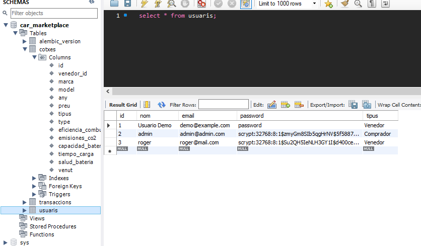
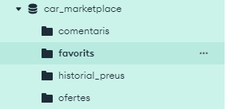
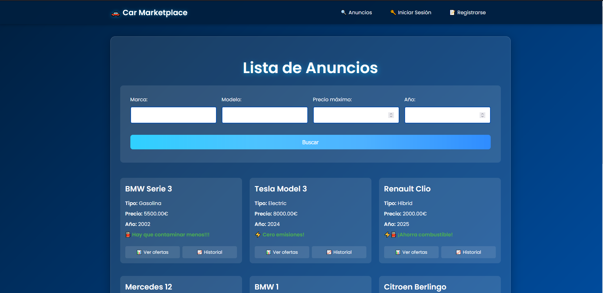
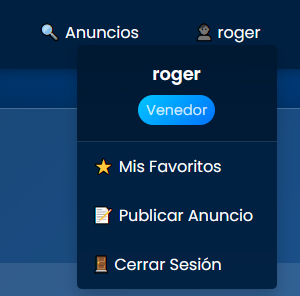

# Docmentació compra-venda de cotxes

# Índex

## Estat Inicial
L'aplicació dels meus companys que he hagut de modificar estava realment molt ben feta, sobretot la part visual, la qual pràcticament no he tocat si no ha sigut per aplicar-la a les noves *features*, i estava en forma modular, de manera que cada template te el seu propi CSS assignat. Tot i això, hi havien algunes coses millorables:
- No hi havia readme.md. En un entorn de treball s'hauria d'especificar en que consisteix l'aplicació, algunes de les seves característiques i tecnologies clau i com s'utilitza.
- No havia fitxer de dependències ni de posada en marxa de l'aplicació. És un gran problema si es una gran aplicació perquè has de mirar manualment de quines llibreries requereix i en el cas de que no sigui un simple executable; com és el cas, pot causar confusió als usuaris finals que no tenen coneixements tècnics.
- L'aplicació tenia features que encara no eren funcionals pero estaven parcialment integrades, com ara l'implementació d'usuaris i els descomptes/ofertes, que estaven a un preu fix (21%). S'hagués pogut comentar per a ajudar a identificar-ho.

## Implementació de les BBDD i ORM
He implementat les bases de dades relacionals i no relacionals tal i com s'indica a l'enunciat.

*Mostra taules i columnes SQL*

*Col·lecions de Mongo*

*Exemple de documents de Mongo*

### (Explicació dels motius de SQL i MongoDB aquí)

### Què és un ORM?
Un ORM (Object-Relational Mapping, o Mapeig Objecte-Relacional) és una tècnica de programació que permet interactuar amb una base de dades relacional (com MariaDB, MySQL o PostgreSQL) utilitzant objectes de programació en lloc de consultes SQL directes. En essència, un ORM actua com un pont entre el codi de l'aplicació (normalment escrit en un llenguatge com Python) i la base de dades, traduint operacions sobre objectes en consultes SQL i viceversa.

Un ORM, essencialment, ens proporciona les següents avantatges:

**1. Abstracció de la base de dades**
    Els desenvolupadors treballen amb classes i objectes en lloc d'escriure SQL. Per exemple, una taula cotxes es representa com una classe Cotxe, i cada fila és una instància d'aquesta classe, això elimina la necessitat d'escriure consultes complexes.

**2. Mapeig objecte-relacional**
    Cada classe (model) es mapeja a una taula de la base de dades, i els atributs de la classe corresponen a les columnes de la taula. Les relacions entre taules (com claus foranes) es gestionen amb atributs especials, com relationship en SQLAlchemy.

**3. Seguretat**
    Els ORMs prevenen atacs d'injecció SQL, ja que converteixen les entrades de l'usuari en consultes segures (queries preparades).

**4. Portabilitat**
    Un ORM facilita canviar de sistema de base de dades (p.ex., de MariaDB a PostgreSQL) amb canvis mínims al codi, ja que l'ORM abstraeix la sintaxi específica de cada base de dades.

I una de les raons principals:
**5. Productivitat**
    Redueix el temps de desenvolupament en permetre operacions com crear, llegir, actualitzar i eliminar (CRUD) amb mètodes senzills com query.all() o session.add().
#### Per què he utilitzat un ORM?
La raó principal és perquè simplement volia aprendre a utilizar-lo ja que és una tecnologia que veig present en molts projectes per la seva simplicitat, seguretat i escalabilitat. He adaptat els mètodes tradicionals a l'hora d'utilitzar BBDD als d'un ORM, com per exemple la creació d'un model Cotxe, l'ús de Flask-WTF per a formularis, la substitució de JSON per consultes SQLAlchemy, la integració amb MongoDB per a dades dinàmiques, i l'actualització de rutes i plantilles. Aquestes canvis no només alineen l'aplicació amb el disseny original (MariaDB + MongoDB) sinó que també la fan més robusta i fàcil de mantenir, especialment amb les noves funcionalitats per a cotxes elèctrics i híbrids.

## Canvis fets (Frontend)

### Anuncis Home 
Abans els anuncis eren només línies de text. Els he aplicat un estil de cuadrícula mostrant els detalls més importants i amb els botons d'acció necessaris (favorits, ofertes, historial, ) que no tots son visibles si no has iniciat sessió. També he afegit una barra de navegació superior 

*Anuncis sense iniciar sessió*

*Anuncis quan has iniciat sessió*

També, per a gestionar els comptes, clicant al nostre perfil podem accedir de manera ràpida a les accions que tenim permeses segons el rol.

*El meu compte*

## Canvis fets (Backend)
S'han afegit tots els nous camps que poden tenir els cotxes com a models per al ORM. S'han implementat sistemes d'encriptació, CORS per a utilitzar l'API del mapa.

## Extensions afegides

### Nous camps per als cotxes
S'han afegit els següents camps:
- Capacitat de bateria en kWh per als cotxes electrics i hibrids
- Temps de carrega
- Eficiència de combustible per a híbrids (L/100km)
- Emissions CO2 (g/km)

### Sistema d'usuaris
Necessari per poder emmagatzemar el tipus d'usuaris (Comprador/Venedor). Les contrassenyes es guarden de forma encriptada a la BBDD SQL.

### Afegit indicador de salut de bateria 
Es mostra de manera automàtica als cotxes híbrids i elèctrics en forma de barra de percentatge.

### Integració de mapa d'estacions de càrrega compatibles amb estandards_carrega mitjançant 
Utilizo l'API de [OpenChargeMap](https://openchargemap.io) per a mostrar les estacions de càrrega compatibles amb l'estàndard del vehicle en forma de mapa. Només es mostra en coches elèctrics ja que la resta no necessiten d'estació de càrrega.

### 