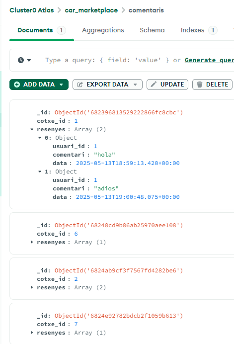
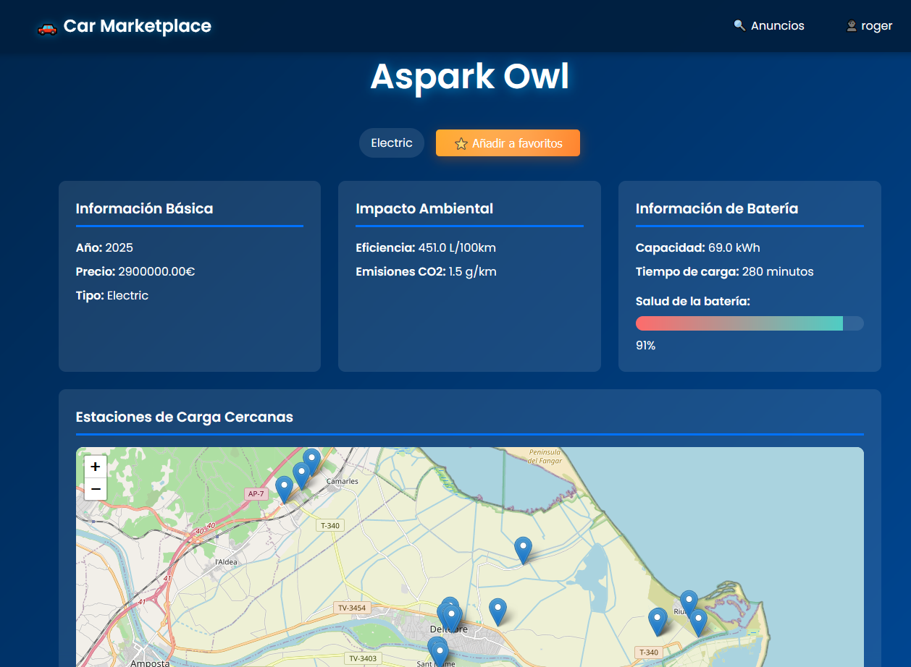
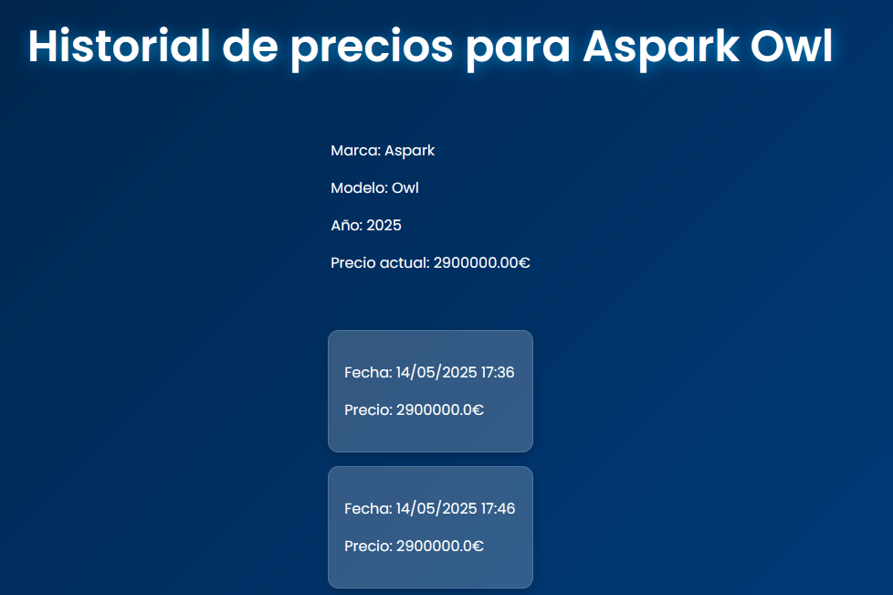
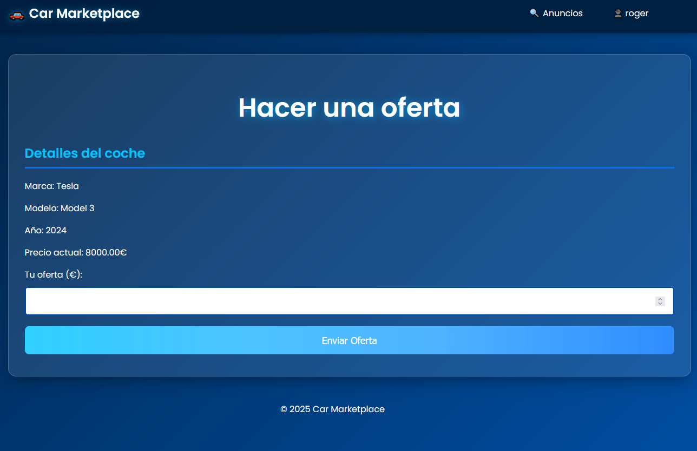
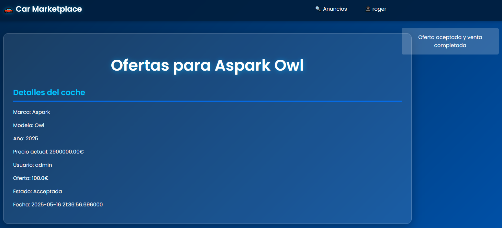
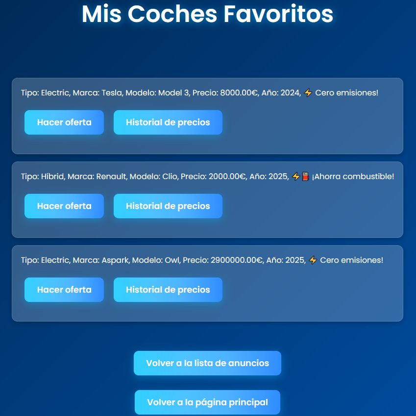
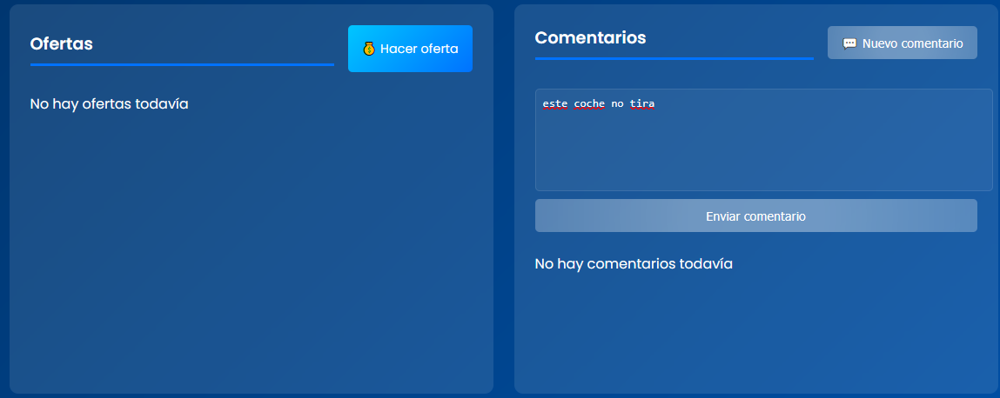

# Documentació compra-venda de cotxes

# Índex
- [Estat Inicial](#estat-inicial)
- [Requeriments i ús](#requeriments-i-ús)
- [Implementació de les BBDD i ORM](#implementació-de-les-bbdd-i-orm)
- [Què és un ORM?](#què-és-un-orm)
- [Canvis fets (Frontend)](#canvis-fets-frontend)
- [Canvis fets (Backend)](#canvis-fets-backend)
- [Extensions afegides](#extensions-afegides)
- [Conclusions i notes](#conclusions-i-notes)

## Estat Inicial
L'aplicació dels meus companys que he hagut de modificar estava realment molt ben feta, sobretot la part visual, la qual pràcticament no he tocat si no ha sigut per aplicar-la a les noves *features*, i estava en forma modular, de manera que cada template te el seu propi CSS assignat. Tot i això, hi havien algunes coses millorables:
- No hi havia readme.md. En un entorn de treball s'hauria d'especificar en que consisteix l'aplicació, algunes de les seves característiques i tecnologies clau i com s'utilitza.
- No havia fitxer de dependències ni de posada en marxa de l'aplicació. És un gran problema si es una gran aplicació perquè has de mirar manualment de quines llibreries requereix i en el cas de que no sigui un simple executable; com és el cas, pot causar confusió als usuaris finals que no tenen coneixements tècnics.
- L'aplicació tenia features que encara no eren funcionals pero estaven parcialment integrades, com ara l'implementació d'usuaris i els descomptes/ofertes, que estaven a un preu fix (21%). S'hagués pogut comentar per a ajudar a identificar-ho.
- Els idiomes estaven mesclats, una mica de català i una mica de castellà. Això m'ha donat molts problemes a l'hora de fer modificacions perquè havien algunes funcions que estaven en català i altres relacionades amb elles que estaven en castellà. He intentat estandaritzar algun dels idiomes però em generava massa confusió i al final he hagut de fer el codi "bilingüe"

## Requeriments i ús
Per a poder utilitzar l'aplicació web de forma correcta, s'ha de crear un entorn virtual en Python 3.11+ amb `python3 -m venv` (ruta) i activar-lo depenent del sistema operatiu que estiguis utilitzant. Una vegada activat, instal·lar els requeriemnents amb `pip install -r requirements.txt`. També hauras de crear un fitxer *.env* a la ruta arrel del projecte amb les cadenes de connexió necessaries per utilitzar MariaDB i MongoDB, amb les següents variables:
- **DATABASE_URL**=ruta_db_sql
- **MONGO_URI**=ruta_cluster_mongodb
- **MONGO_DB**=nom_db_mongodb
- **OPENCHARGE_API_KEY**=clau_opencharge.io *Opcional però recomanat*

Una vegada dins de la web, **activa** el permís d'accés a l'ubicació per a que l'API del mapa funcioni correctament.

## Implementació de les BBDD i ORM
He implementat les bases de dades relacionals i no relacionals tal i com s'indica a l'enunciat.

*Mostra taules i columnes SQL*

*Col·leccions de MongoDB: favorits, comentaris, historial_preus, ofertes*

*Exemple de documents de MongoDB*

> Les imatges anteriors mostren l'estructura de les BBDD utilitzades: MariaDB per a la informació estructurada (usuaris, cotxes, transaccions) i MongoDB per a dades dinàmiques (favorits, comentaris, historial de preus, ofertes).

### (Explicació dels motius de SQL i MongoDB aquí)

## Què és un ORM?
Un ORM (Object-Relational Mapping, o Mapeig Objecte-Relacional) és una tècnica de programació que permet interactuar amb una base de dades relacional (com MariaDB, MySQL o PostgreSQL) utilitzant objectes de programació en lloc de consultes SQL directes. En essència, un ORM actua com un pont entre el codi de l'aplicació (normalment escrit en un llenguatge com Python) i la base de dades, traduint operacions sobre objectes en consultes SQL i viceversa.

Un ORM, essencialment, ens proporciona les següents avantatges:

**1. Abstracció de la base de dades**
    Els desenvolupadors treballen amb classes i objectes en lloc d'escriure SQL. Per exemple, una taula cotxes es representa com una classe Cotxe, i cada fila és una instància d'aquesta classe, això elimina la necessitat d'escriure consultes complexes.

**2. Mapeig objecte-relacional**
    Cada classe (model) es mapeja a una taula de la base de dades, i els atributs de la classe corresponen a les columnes de la taula. Les relacions entre taules (com claus foranes) es gestionen amb atributs especials, com relationship en SQLAlchemy.

**3. Seguretat**
    Els ORMs prevenen atacs d'injecció SQL, ja que converteixen les entrades de l'usuari en consultes segures (queries preparades).

**4. Portabilitat**
    Un ORM facilita canviar de sistema de base de dades (p.ex., de MariaDB a PostgreSQL) amb canvis mínims al codi, ja que l'ORM abstraeix la sintaxi específica de cada base de dades.

I una de les raons principals:
**5. Productivitat**
    Redueix el temps de desenvolupament en permetre operacions com crear, llegir, actualitzar i eliminar (CRUD) amb mètodes senzills com query.all() o session.add().
#### Per què he utilitzat un ORM?
La raó principal és perquè simplement volia aprendre a utilizar-lo ja que és una tecnologia que veig present en molts projectes per la seva simplicitat, seguretat i escalabilitat. He adaptat els mètodes tradicionals a l'hora d'utilitzar BBDD als d'un ORM, com per exemple la creació d'un model Cotxe, l'ús de Flask-WTF per a formularis, la substitució de JSON per consultes SQLAlchemy, la integració amb MongoDB per a dades dinàmiques, i l'actualització de rutes i plantilles. Aquestes canvis no només alineen l'aplicació amb el disseny original (MariaDB + MongoDB) sinó que també la fan més robusta i fàcil de mantenir, especialment amb les noves funcionalitats per a cotxes elèctrics i híbrids.

## Canvis fets (Frontend)

### Anuncis Home
Abans els anuncis eren només línies de text. Ara s'ha implementat una visualització en forma de graella (grid) amb targetes per a cada cotxe, mostrant els detalls més importants i amb botons d'acció (favorits, ofertes, historial). Els botons d'acció només són visibles si l'usuari ha iniciat sessió.

*Anuncis sense iniciar sessió*

*Anuncis quan has iniciat sessió (es mostren més accions)*

La barra de navegació superior permet accedir ràpidament a les diferents seccions de l'aplicació. El menú d'usuari mostra accions específiques segons el rol (comprador/venedor):

*El meu compte: accés ràpid a funcionalitats segons el rol*

#### Altres millores visuals i funcionals:
- Formulari de cerca avançada per marca, model, preu i any.
- Indicadors visuals per a cotxes venuts i estat de les ofertes.
- Barra de salut de bateria per a elèctrics/híbrids (veure exemple a `detalles_electrico1.png`).

## Canvis fets (Backend)
S'han afegit tots els nous camps que poden tenir els cotxes com a models per al ORM (veure `models.py`). S'han implementat sistemes d'encriptació de contrasenyes, CORS per a utilitzar l'API del mapa, i gestió d'usuaris amb rols diferenciats.

## Extensions afegides

### Nous camps per als cotxes
S'han afegit els següents camps (veure codi a `models.py` i formularis de publicació):
- Capacitat de bateria en kWh per als cotxes elèctrics i híbrids
- Temps de càrrega
- Eficiència de combustible per a híbrids (L/100km)
- Emissions CO2 (g/km)

### Sistema d'usuaris
Necessari per poder emmagatzemar el tipus d'usuaris (Comprador/Venedor). Les contrasenyes es guarden de forma encriptada a la BBDD SQL.

### Afegit indicador de salut de bateria
Es mostra de manera automàtica als cotxes híbrids i elèctrics en forma de barra de percentatge.

*Exemple de barra de salut de bateria en un cotxe elèctric*

### Integració de mapa d'estacions de càrrega compatibles
Utilitzo l'API de [OpenChargeMap](https://openchargemap.io) per a mostrar les estacions de càrrega compatibles amb l'estàndard del vehicle en forma de mapa. Només es mostra en cotxes elèctrics ja que la resta no necessiten d'estació de càrrega.

### Historial de preus i sistema d'ofertes
Cada cotxe té un historial de preus (MongoDB) i es poden fer ofertes, acceptar-les o rebutjar-les. El sistema d'ofertes i historial es mostra amb gràfics i llistats:

*Historial de preus d'un cotxe*

*Formulari per fer una oferta*

*Exemple d'oferta acceptada*

### Gestió de favorits i comentaris
Els usuaris poden afegir cotxes a favorits i deixar comentaris, tot gestionat amb MongoDB:

*Llistat de cotxes favorits d'un usuari*

*Exemple de comentari en un anunci*

---

> Totes les funcionalitats i canvis han estat documentats amb captures de pantalla a la carpeta `documentacio/` i referenciats en aquest document. Per a més detalls tècnics, consulteu els fitxers `models.py`, `app.py`, `mongo_db.py` i les plantilles HTML.

## Conclusions i notes
El projecte ha evolucionat significativament des de la seva versió inicial, tant a nivell visual com funcional i tècnic. S’ha aconseguit una aplicació web robusta, moderna i fàcil d’utilitzar, que integra tant bases de dades relacionals (MariaDB) com no relacionals (MongoDB) per gestionar de manera eficient la informació estructurada i dinàmica.

La incorporació d’un sistema d’usuaris amb rols diferenciats (comprador/venedor), la gestió segura de contrasenyes, l’historial de preus, el sistema d’ofertes i favorits, així com la integració d’APIs externes com OpenChargeMap, han aportat un gran valor afegit a l’experiència d’usuari i a la funcionalitat global de l’aplicació.

A nivell de codi, l’ús d’un ORM ha facilitat la gestió de la base de dades i ha fet el projecte més escalable i segur.

En resum, el projecte compleix amb els requisits plantejats i ofereix una base sòlida per a futures millores, com ara la implementació de notificacions, filtres avançats o adjustar les ofertes. El procés de desenvolupament ha estat una gran oportunitat per aprofundir en tecnologies clau del desenvolupament web modern i en bones pràctiques de programació.

> ***Nota 1**: encara no entenc molt bé el sentit te tenir un historial de preus per a un servei de compra-venda P2P al ser una venda única, a no ser que es registre el model, any i marca del cotxe per a comparar amb un dataset més gran.*
> ***Nota 2**: les dades amb les que se m'ha entregat el projecte (data,json) es migren automàticament, inclús en cas d'afegir-ne de noves de forma manual al fitxer.*
> ***Nota 3**: quan havia de modificar la BBDD relacional he descobert que amb el paquet de flask-migrate podia automatizar les modificacions fetes al ORM per a passar-les a la BBDD sense haver de trencar-me el cap.*